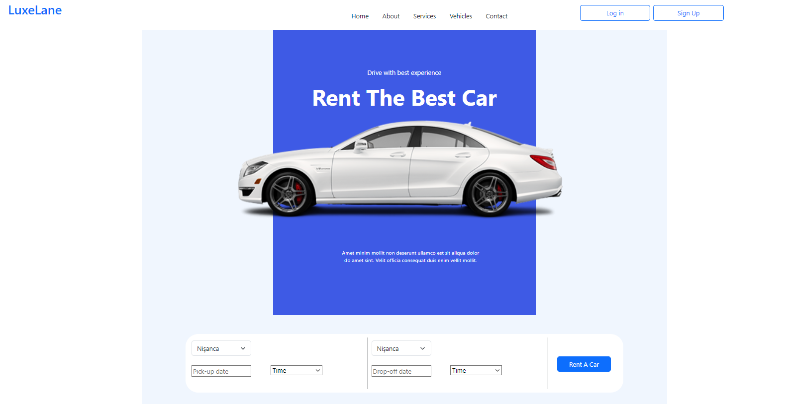
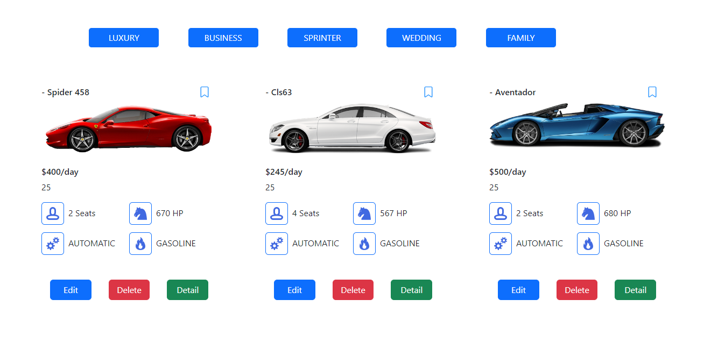

# LuxeLane 🚗✨

LuxeLane is a web application that allows users to rent luxury cars.
## Features 🌟 

- 🔒 User registration and login
- 🚙 List of Luxury cars by categories
- 📅 Car rental function for the desired date or time range
- 📝 Users can view their orders on their personal page
- 🧐 Detailed review of luxury cars
- 🛠️ Admin can add, delete, and edit cars,brand,branch


## Technologies Used 💻

- 💻 [JavaScript](https://tr.javascript.info/) - A versatile language for building dynamic and interactive web applications.
- 🗄️ [Sqlite](https://sqlite.org/) - Serverless relational database management system.
- 🔧 [Handlebars](https://handlebarsjs.com/) - A simple templating language
- 🌐 [Express.js](https://expressjs.com/) - Web framework for Node.js 
- 🎨 [Bootstrap](https://getbootstrap.com/) - Powerful, extensible, and feature-packed frontend toolkit
- ⏲️ [Express Validation](https://express-validator.github.io/docs/) - Validation middleware for Express.js
- ✅ [Express Session](https://www.npmjs.com/package/express-session/) - An "express session" is a quick, focused meeting for achieving specific goals.
- 🔒 [Bcrypt](https://www.npmjs.com/package/bcrypt/) - A library to help you hash passwords.
- 📂 [Multer](https://www.npmjs.com/package/multer/) - A middleware for handling multipart/form-data in Node.js, primarily used for uploading files.


## Installation and Running 🏃

To run the project locally, follow these steps:

1. Clone the repository:

    ```bash
    git clone https://github.com/ertugrulsertaslan/luxelane.git
    ```
2. Navigate to the project directory:

    ```bash
    cd luxelane
    ```
3. Install the necessary dependencies and start the project:

    ```bash
    npm i && node server.js
    ```
4. Open your browser and go to `http://localhost:8080` to use the application.


## Usage 🚀

### Registration and Login 🔑

- In order to rent a car, users must register and log in to the system.

### Car rental 🚗 

- Login users can browse the list of luxury cars and rent the vehicles they prefer at the desired time and date range.

### User Orders 📋

- Users can view their orders from their personal pages.

### Administrator Features 🛠️

- Administrators can add new cars, brands and branches to the list.
- Administrators can delete cars, brands and branches from the list.
- Administrators can edit the details of the current car, brand and branch.

## Screenshots 📸

### Home Page 🏠


### Admin Car List 🛠️



## License 📜

[](https://choosealicense.com/licenses/mit/)


